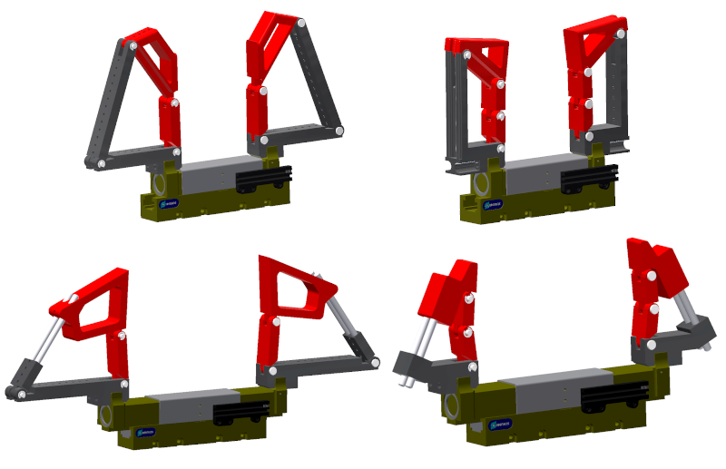

## Matlab Functions for Computing Contact Forces of Self-Adaptive Fingers based on Four-bar Linkages
### Public Repository of the paper "Force Analysis of Minimal Self-adaptive Fingers Using Variations of Four-bar Linkages"

Open source paper available at: https://ms.copernicus.org/articles/12/1037/2021/ 
Cite as: Nassar, F. and Birglen, L.: Force analysis of minimal self-adaptive fingers using variations of four-bar linkages, Mech. Sci., 12, 1037–1049, https://doi.org/10.5194/ms-12-1037-2021, 2021. 
